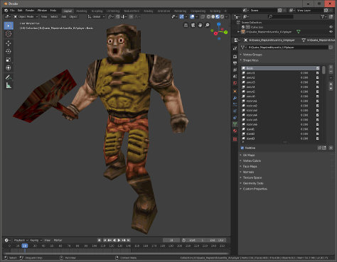

# Quake MDL import/export plugin for Blender

## Download

- [2.8+ (works with 2.9x and 3.x)](https://github.com/vncastanheira/Blender-MDL-Exporter/releases/download/2.8/Blender-MDL-Exporter_2.8.zip)

## Info
This extension converts a mesh to a compatible .mdl format.
The texture will be converted to 256x256 size and the colors will be mapped
to the equivalent color palette.
Since the last 32 colors in the Quake palette are reserved to full bright 
colors (will glow even in the dark), there's a custom setting to prevent 
textures from getting bright colors.

## Exporting
- select the mesh
- set a custom property "bright" to:
	- lit colors
	-  normal colors
- export to destination file

# Credits
Originally developed by Bill Currie for QuakeForge, updated for Blender 2.8 by khreathor with a little help of queenjaz.